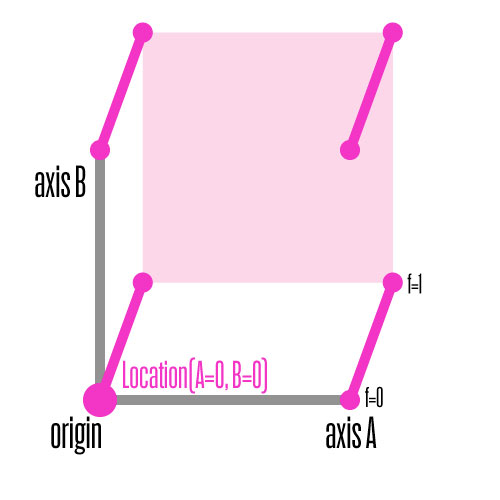

DesignSpace Factors
===================

In MutatorMath instances are calculated by multiplying all masters with a specific factor and then adding them all up. Determining the factors is then the important job. MutatorMath has to deal with all sorts of edge cases and extrapolation so the code might be a bit cryptic, but the basic idea is not so complex. So here are some images.

These graphs were made with Drawbot and represent actual factors calculated by MutatorMath. It is a <em>two dimensional designspace</em> with four masters. The axes are gray. The third dimension maps the value of the factors of the masters: 0 in the plane with the axes, 1 up in space. So while it looks like a three axis system, it is a two axis system with the factors as the third dimension.

The master at the <em>origin</em>, the place where all dimensions are 0, is called <em>neutral</em>. All other on-axis masters in the designspace are relative to this neutral. That means that the neutral is subtracted from each. At the end of the calculation the neutral is added again to <em>inflate</em> the instance. So the factor for the neutral is 1, it is part of everything. The factors of the neutral master form a box.

Now we insert the second master at `Location(A=1, B=0)`. It is <em>on-axis</em> because only one of its dimensions (A) has magnitude. Its factor is 1 along the line A=1. Note its factor is 0 at the origin and at the line A=0 (and all other axes if we had more). In this designspace the influence of this master forms a wedge.

Next we insert a another on-axis master, but now at `Location(A=0, B=1)`. This factor is 1 along the line B=1, it is 0 at the origin and the line B=1. It looks like another wedge.

But we also want to include masters at other locations, what about `Location(A=1, B=1)` for instance? We can see that at that location both on-axis masters are at full force, and even the neutral is added with factor 1. Here something interesting needs to happen. First MutatorMath calculates the instance at that location using only the on-axis masters. If you were to look at this instance closely it would be distorted: it is an extrapolation. This on-axis-only instance is then <em>subtracted</em> from the object we want to insert. Now the sum of the masters will look familiar again: the off-axis master corrects it. The factors for an off-axis master look like a part of a pyramid.
